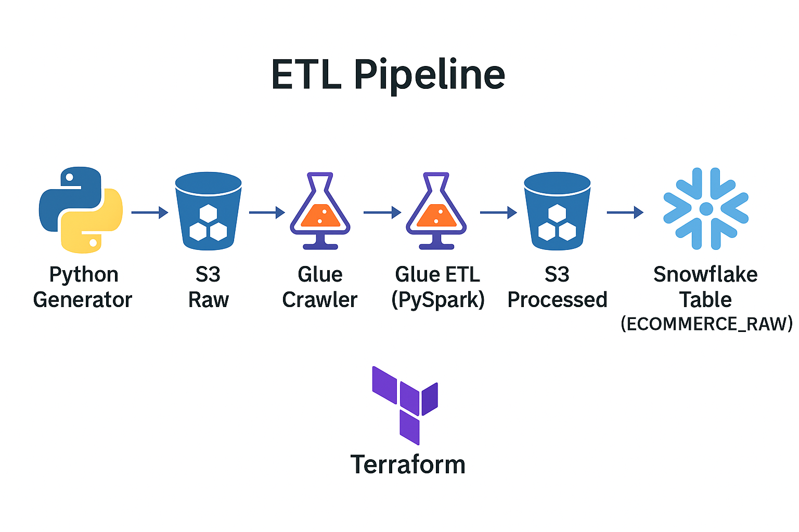

# Assignment 4: Data Warehouse Integration Pipeline

## 🎯 Objective
The goal of this project is to **integrate multiple data sources into a centralized Snowflake data warehouse**. The pipeline ingests raw e-commerce data, transforms and cleans it using **AWS Glue (PySpark)**, stores it in Amazon S3, and finally loads it into **Snowflake** for analysis. All infrastructure is provisioned using **Terraform** (no manual console steps).  

## 🧰 Services & Tools Used
| Stage            | Technology / Service                          |
|------------------|-----------------------------------------------|
| Data Storage     | Amazon S3 (raw + processed buckets)           |
| Data Cataloging  | AWS Glue Catalog + Crawlers                   |
| ETL Processing   | AWS Glue ETL Job (PySpark)                    |
| Orchestration    | Python (Boto3, PySpark)                       |
| Infrastructure   | Terraform (IaC)                               |
| Permissions      | IAM Roles & Policies                          |
| Data Warehouse   | Snowflake                                     |
| Query Language   | SQL                                           |

## 🏗️ Architecture




## ⚙️ Step-by-Step Workflow
### 1. Data Ingestion (Generator → S3)
- Python script (`generator/ecommerce_stream_s3.py`) simulates **e-commerce data** (orders, payments, customers).
- Raw data stored in JSONL format in S3 bucket:
s3://aws-project-4-raw-data/raw/ecommerce/


### 2. Data Cataloging
- AWS Glue Crawler configured via Terraform (`infra/aws/glue.tf`).
- Automatically catalogs raw data into Glue Data Catalog for schema discovery.

### 3. ETL Transformation
- PySpark ETL script (`infra/aws/transform_raw_to_cleaned.py`) runs as a Glue Job.
- Cleaning & transformations:
- Trim strings, cast numeric fields
- Standardize dates (`yyyy-MM-dd`)
- Compute `order_amount`
- Fill missing values with defaults
- Reduce schema to **7 essential fields**:
  ```
  order_id, customer_id, order_date, product,
  quantity, order_amount, payment_status
  ```
- Outputs a **single CSV file per batch** into:
s3://aws-project-4-processed-data/cleaned-csv/ecommerce/final_batch_<uuid>/ecommerce_clean_<timestamp>.csv

## 4. Data Loading (Snowflake)

- External stage **`ECOMMERCE_STAGE`** points to the processed S3 prefix.
- Cleaned CSVs are loaded into the **`ECOMMERCE_RAW`** table.
- Validation queries confirm row counts and schema alignment.


## 🚀 Deployment Instructions

### 1. Provision Infrastructure

cd infra/aws
terraform init
terraform apply

### 2. Generate Raw Data
cd generator
python ecommerce_stream_s3.py

### 3. Run ETL Job
- The Glue job (defined in Terraform) runs transform_raw_to_cleaned.py.
- Output: single CSV per batch under
- s3://aws-project-4-processed-data/cleaned-csv/ecommerce/final_batch_<uuid>/.

### 4. Load Data into Snowflake
- Open Snowflake Worksheet and run the SQL in the SQL Setup section.

### 📊 SQL Setup (run in Snowflake) 
### Create Target Table
- CREATE OR REPLACE TABLE ECOMMERCE_RAW (
  ORDER_ID       VARCHAR,
  CUSTOMER_ID    VARCHAR,
  ORDER_DATE     DATE,
  PRODUCT        VARCHAR,
  QUANTITY       NUMBER,
  ORDER_AMOUNT   NUMBER(12,2),
  PAYMENT_STATUS VARCHAR
);
### Copy Cleaned CSVs From Stage
USE DATABASE SNOWFLAKE_LEARNING_DB;
USE SCHEMA PUBLIC;

COPY INTO ECOMMERCE_RAW
FROM @ECOMMERCE_STAGE
PATTERN='.*final_batch_.*/ecommerce_clean_.*\\.csv'
FILE_FORMAT=(TYPE=CSV SKIP_HEADER=1 FIELD_OPTIONALLY_ENCLOSED_BY='"')
ON_ERROR=CONTINUE;

### Quick Verification
SELECT COUNT(*) FROM ECOMMERCE_RAW;
SELECT * FROM ECOMMERCE_RAW ORDER BY ORDER_DATE DESC, ORDER_ID DESC LIMIT 20;

